# 📖 Manual de Usuario - CalendarApp

Una guía completa para usar CalendarApp.

---

## 📋 Tabla de Contenidos

1. [Introducción](#📝-introducción)
2. [Primeros Pasos](#🚀-primeros-pasos)
3. [Interfaz Principal](#🖥️-interfaz-principal)
4. [Gestión de Eventos](#📅-gestión-de-eventos)
5. [Navegación del Calendario](#🧭-navegación-del-calendario)
6. [Configuraciones](#⚙️-configuraciones)
7. [Funciones Especiales](#✨-funciones-especiales)

---

## 📝 Introducción

CalendarApp es una aplicación de calendario moderna que te permite organizar tus eventos de manera eficiente. Incluye funciones como:

- ✅ Gestión completa de eventos
- ✅ Múltiples vistas (Mes, Semana, Día)
- ✅ Información meteorológica en eventos
- ✅ Modo oscuro y claro
- ✅ Soporte multiidioma (Español/Inglés)
- ✅ Mini calendario lateral con eventos próximos
- ✅ Interfaz moderna y responsiva

---

## 🚀 Primeros Pasos

### Registro de Cuenta

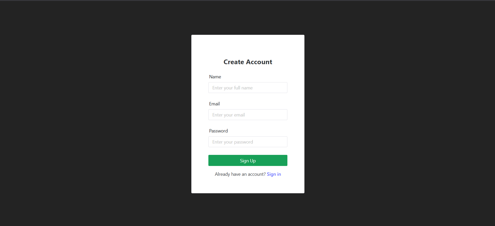

1. **Accede a la página de registro** desde el enlace "Sign up"
2. **Completa el formulario:**
   - **Nombre completo**: Tu nombre y apellido
   - **Email**: Dirección de correo electrónico válida
   - **Contraseña**: Crea una contraseña segura
3. **Haz clic en "Sign Up"**
4. **¡Listo!** Serás redirigido automáticamente al calendario

### Iniciar Sesión

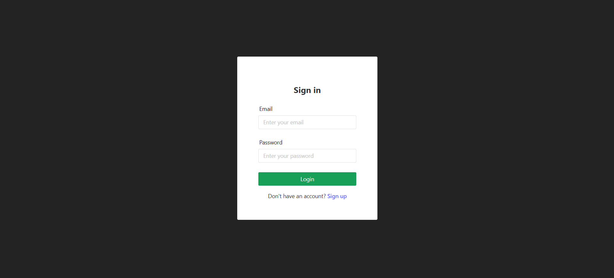

1. **Ingresa tu email y contraseña**
2. **Haz clic en "Login"**
3. **Serás redirigido al calendario principal**

**Nota:** Si ya tienes una cuenta, puedes acceder directamente desde la página de registro haciendo clic en "Already have an account? Sign in".

---

## 🖥️ Interfaz Principal

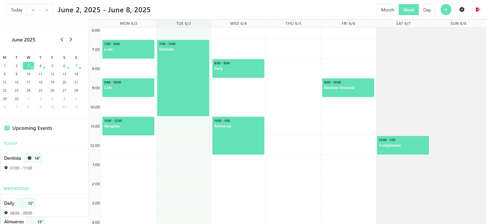

La interfaz se divide en **3 áreas principales**:

### 1. **Barra Superior**
- **Navegación temporal**: Botones "Today", "←", "→"
- **Título del período**: Muestra el mes/semana/día actual
- **Selector de vistas**: Botones Month, Week, Day
- **Acciones rápidas**: 
  - **Crear evento** (+): Botón verde para agregar eventos
  - **Configuraciones** (⚙️): Acceso a ajustes
  - **Cerrar sesión**: Para salir de la aplicación

### 2. **Sidebar Izquierdo**
Contiene dos secciones principales:

#### Mini Calendario
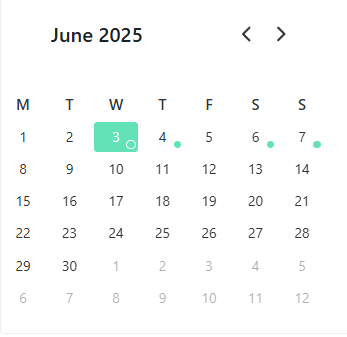
- **Navegación rápida**: Haz clic en cualquier fecha
- **Indicadores visuales**: Puntos verdes en días con eventos
- **Controles**: Flechas para cambiar de mes

#### Lista de Eventos Próximos  
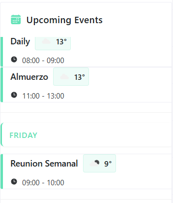
- **Eventos de hoy**: Marcados como "TODAY"
- **Próximos eventos**: Organizados por día
- **Información del clima**: Temperatura e ícono meteorológico
- **Horarios**: Formato configurable (12h/24h)

### 3. **Área Principal del Calendario**
- **Vista de eventos**: Cambia según la vista seleccionada
- **Interacción directa**: Haz clic en fechas para crear eventos
- **Eventos visuales**: Código de colores y información clara

---

## 📅 Gestión de Eventos

### Crear un Evento

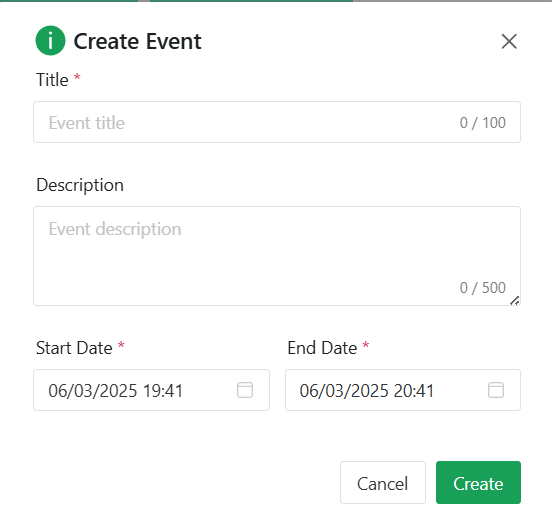

**Métodos para crear eventos:**

**Método 1 - Botón (+):**
1. Haz clic en el botón verde **"+"** en la barra superior
2. Se abrirá el modal de creación de eventos

**Método 2 - Clic en fecha:**
1. Haz clic en cualquier fecha del calendario
2. Se abrirá el modal con la fecha preseleccionada

**Método 3 - Selección de rango:**
1. Haz clic y arrastra para seleccionar un período
2. El evento se creará automáticamente con esas fechas/horas

### Formulario de Creación

**Campos disponibles:**
- **Event Title**: Nombre del evento (obligatorio)
- **Description**: Detalles adicionales (opcional)
- **Start Date/Time**: Fecha y hora de inicio
- **End Date/Time**: Fecha y hora de finalización

**Controles del formulario:**
- **Save Event**: Guarda el nuevo evento
- **Cancel**: Cierra el modal sin guardar

### Editar un Evento

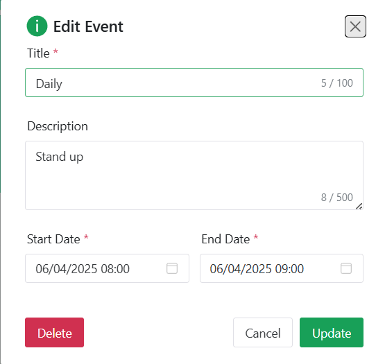

**Formas de editar:**

1. **Clic directo**: Haz clic en cualquier evento para abrirlo
2. **Desde el sidebar**: Clic en eventos de la lista lateral
3. **Arrastrar y soltar**: Mueve eventos directamente en el calendario
4. **Redimensionar**: Arrastra los bordes para cambiar la duración

**En el modal de edición puedes:**
- Modificar título y descripción
- Cambiar fechas y horarios
- **Delete Event**: Eliminar el evento permanentemente
- **Save Event**: Guardar los cambios

---

## 🧭 Navegación del Calendario

### Vista Mensual

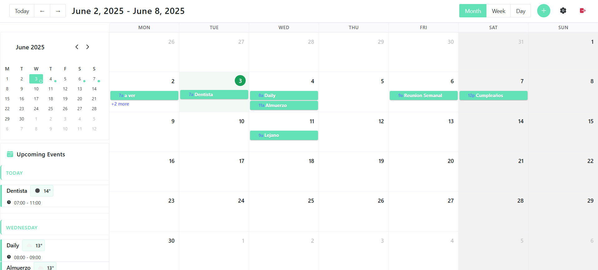

**Características:**
- Muestra el mes completo
- Eventos aparecen como barras de colores
- Ideal para planificación a largo plazo
- Fácil visualización de días ocupados vs. libres

### Vista Diaria

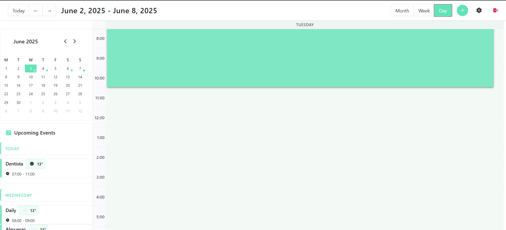

**Características:**
- Enfoque detallado en un solo día
- Vista horaria completa (24 horas)
- Perfecto para días muy ocupados
- Muestra duración exacta de cada evento
- Permite crear eventos arrastrando en franjas horarias

### Navegación Temporal

**Controles disponibles:**
- **"Today"**: Regresa inmediatamente a la fecha actual
- **"←"**: Navega al período anterior (mes/semana/día)
- **"→"**: Navega al período siguiente
- **Mini calendario**: Clic en cualquier fecha para saltar directamente
- **Título del período**: Muestra claramente dónde te encuentras

---

## ⚙️ Configuraciones

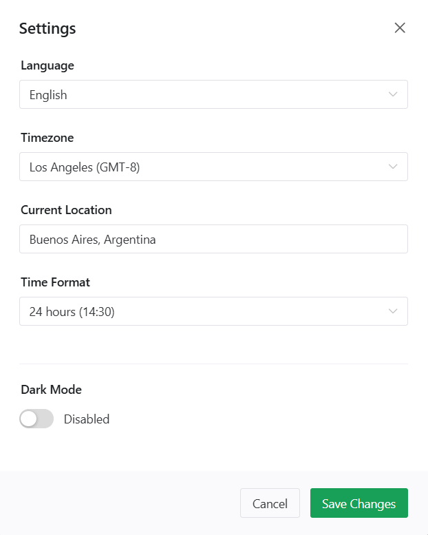

Accede a las configuraciones haciendo clic en el botón **⚙️** en la barra superior.

### Opciones de Personalización

#### 🌍 **Language / Idioma**
- **Español**: Interfaz completa en español
- **English**: Interfaz completa en inglés
- *El cambio es inmediato al seleccionar*

#### 🕐 **Time Format / Formato de Hora**
- **12-hour**: Formato AM/PM (ej: 2:30 PM)
- **24-hour**: Formato militar (ej: 14:30)
- *Afecta a toda la aplicación y sidebar*

#### 🎨 **Theme / Tema**
- **Light Mode**: Interfaz clara y brillante
- **Dark Mode**: Interfaz oscura (ver sección siguiente)
- *Perfecto para uso en diferentes condiciones de luz*

#### 👤 **Profile Information**
- **Name**: Actualiza tu nombre de perfil
- **Email**: Muestra tu email registrado (solo lectura)

**Botones de acción:**
- **Save Settings**: Guarda todos los cambios
- **Cancel**: Cierra sin guardar

---

## ✨ Funciones Especiales

### 🌙 Modo Oscuro

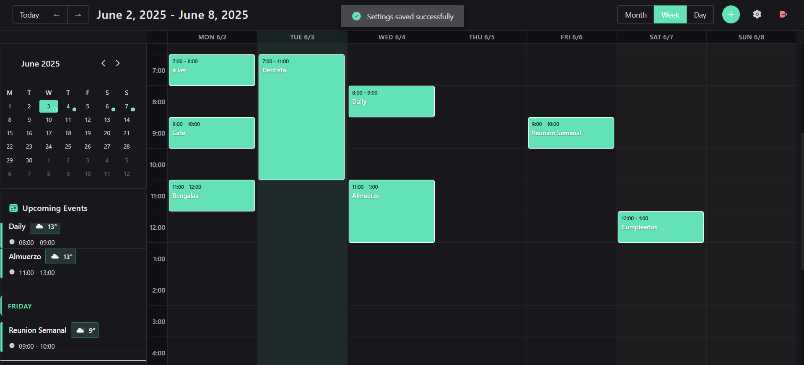

**Beneficios del modo oscuro:**
- ✅ Reduce la fatiga visual en ambientes oscuros
- ✅ Ideal para uso nocturno
- ✅ Interfaz elegante y moderna
- ✅ Ahorra batería en pantallas OLED
- ✅ Mantiene toda la funcionalidad

**Cómo activarlo:**
1. Clic en **⚙️** (Configuraciones)
2. Selecciona **"Dark Mode"** en la sección Theme
3. Clic en **"Save Settings"**
4. La interfaz cambia inmediatamente

### 🌤️ Información Meteorológica

**Dónde aparece:**
- En todos los eventos del **sidebar izquierdo**
- Junto al título de cada evento próximo
- Incluye temperatura actual e ícono descriptivo

**Qué información muestra:**
- **Temperatura**: En grados Celsius
- **Condiciones**: Ícono visual del clima
- **Actualización**: Datos en tiempo real

### 📱 Mini Calendario Inteligente

**Funciones avanzadas:**
- **Navegación rápida**: Un clic te lleva a cualquier fecha
- **Indicadores visuales**: Puntos verdes muestran días con eventos
- **Sincronización**: Se actualiza automáticamente con la vista principal
- **Navegación mensual**: Flechas para cambiar rápidamente de mes

---

## 💡 Consejos de Uso

### **Navegación Eficiente**
- Usa el **mini calendario** para saltos rápidos entre fechas
- Aprovecha las **vistas múltiples** según tu necesidad
- El **sidebar** es perfecto para ver eventos próximos de un vistazo

### **Gestión de Eventos**
- **Arrastra y suelta** para mover eventos rápidamente
- **Redimensiona** eventos arrastrando los bordes
- Usa **descripciones** para agregar detalles importantes

### **Personalización**
- Configura el **formato de hora** según tu preferencia
- Cambia al **modo oscuro** para uso nocturno
- Selecciona tu **idioma** preferido para mejor experiencia

---

## 📞 Soporte y Contacto

¿Necesitas ayuda adicional?

- **Para desarrolladores**: Consulta el [README.md](README.md) para información técnica

---
